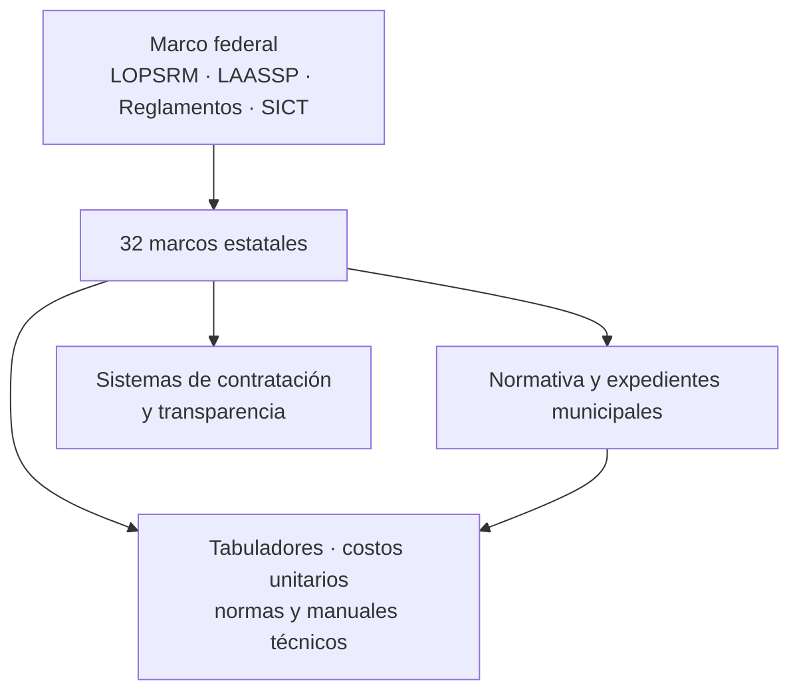

> Parte 1 de 2 del informe jurídico previo (corte 18-sep-2026).
> Se omitieron marcadores internos de citas del motor de investigación; el texto y las URLs oficiales se conservan.
> La clasificación operativa del corpus está en `src/data/ingesta.ts` y `src/data/costos.ts`.

# Inventario nacional de contratación pública, obra pública, adquisiciones y costos unitarios en México

## Resumen ejecutivo

Se realizó un corte de investigación al **18 de septiembre de 2026** sobre fuentes públicas oficiales de la Federación, las **32 entidades federativas** y documentos municipales localizables, restringiendo la búsqueda a congresos estatales, periódicos oficiales, secretarías de obras/infraestructura/finanzas, sistemas estatales de contratación, portales de transparencia, ayuntamientos y dependencias públicas. El inventario resultante contiene **56 registros documentales**, cubre las **32 entidades federativas**, incorpora el marco federal y reúne **27 URLs directas de PDF** que pudieron identificarse inequívocamente.

Los cambios más recientes y relevantes localizados son: el **Reglamento de la Ley de Adquisiciones, Arrendamientos y Servicios del Sector Público federal**, con última reforma del **27 de marzo de 2026**; la nueva **Ley de Obra Pública del Estado de Nayarit**, publicada el **16 de enero de 2026**; la entrada de la **Ley de Obra Pública de Chiapas** que el marco jurídico estatal lista con fecha **29 de abril de 2026**; el texto de la ley de Tabasco alojado por el Congreso en agosto de 2026 e incorporando una reforma de **17 de diciembre de 2025**; y el **Tabulador General de Precios Unitarios de la Ciudad de México actualizado a julio de 2026**.

También se localizaron textos estatales recientes en **Baja California**, con última reforma de la ley de obra pública al **3 de octubre de 2025**; **Oaxaca**, con última reforma al **8 de diciembre de 2025**; **Quintana Roo**, con reforma de su ley de obras publicada el **8 de mayo de 2025**; y **Tamaulipas**, donde la versión oficial más reciente encontrada incorpora reforma del **16 de diciembre de 2024**.

La investigación también permitió descartar algunas versiones antiguas cuando había evidencia de una posterior. Por ejemplo, en **Nayarit** no se conservó como principal la ley de 2005 porque el Periódico Oficial registra una nueva ley en enero de 2026; en **Ciudad de México** se priorizó el tabulador de julio de 2026 sobre los de enero, marzo y mayo de 2025 y mayo de 2026; y en **Tamaulipas** se priorizó la versión que incorpora la reforma de diciembre de 2024 sobre el PDF consolidado en 2022.

**La cobertura municipal no puede considerarse exhaustiva.** Los portales municipales están descentralizados, no existe un repositorio nacional único que reúna reglamentos, manuales, precios unitarios y expedientes de todos los ayuntamientos, y numerosos recursos no son indexables o sólo se publican dentro de obligaciones de transparencia. En este corte se localizaron, entre otros, documentos oficiales de **Amecameca, Zumpango, Ixtlahuacán de los Membrillos, Centro/Villahermosa, Mérida y Xaltocan**. La ausencia en este informe de un documento municipal **no equivale a inexistencia jurídica**.

Hay una segunda limitación técnica importante: el navegador de investigación permitió **abrir/verificar** las páginas y PDFs indicados, pero no expone en todos los casos el código HTTP numérico. Por esa razón no se inventaron valores “200”; en las tablas se usa **“Accesible”** cuando el recurso pudo abrirse o ser recuperado por el verificador, **“Timeout”** cuando la petición agotó tiempo y **“no localizado”** cuando no se obtuvo un recurso directo. El entorno de ejecución de archivos, por su parte, no tuvo salida binaria/DNS a esos portales, por lo que **no fue posible introducir los bytes de los PDFs oficiales en un ZIP**. El ZIP entregado abajo contiene el inventario, accesos `.url` a cada PDF directo y un script reproducible de descarga, pero **no pretende ser un ZIP de los PDFs originales**.

## Metodología, vigencia y criterio de verificación

La prioridad fue siempre el **documento oficial más reciente que pudiera demostrarse**. Una página de un congreso, Periódico Oficial o repositorio jurídico estatal tuvo prioridad sobre copias de terceros; portales no oficiales encontrados incidentalmente no se utilizaron como fuente del inventario. En los casos en que una secretaría, tribunal, órgano autónomo o municipio oficial aloja una copia de la legislación, se conserva esa fuente pero se señala cuando todavía conviene cotejarla con el Periódico Oficial.

Un buen ejemplo de esta cautela es **Morelos**: su Marco Jurídico Digital estaba actualizado al **9 de septiembre de 2026**, ofrece documentos descargables en PDF y Word, pero el propio sitio advierte que la edición electrónica no es la publicación jurídicamente oficial y que la validez corresponde al Periódico Oficial *Tierra y Libertad*.

Para cada registro se intentó obtener: título exacto; tipo documental; fecha de emisión, reforma o actualización; municipio cuando corresponde; página oficial; enlace PDF directo cuando el buscador lo expuso; tamaño del archivo cuando la propia fuente lo reportó; y estado de accesibilidad. Cuando la fuente no permitió confirmar un dato se usa literalmente **“no especificado”**, como solicitó el encargo.

En materia de tamaño de archivos, no se estimaron valores. Por ejemplo, el repositorio oficial de **Campeche** informa expresamente **303 KB** para su Ley de Obras Públicas y la ESFE de **Querétaro** informa **758.81 KB** para la Ley de Obra Pública; ésos sí se reportan.

## Marco federal y fuentes técnicas nacionales

El marco federal es indispensable incluso para los órdenes locales cuando una contratación se encuentra sometida al régimen federal. La Cámara de Diputados mantiene el PDF vigente de la **Ley de Obras Públicas y Servicios Relacionados con las Mismas**, cuya versión consultada señala última reforma publicada en el DOF el **14 de noviembre de 2025**.

La **Ley de Adquisiciones, Arrendamientos y Servicios del Sector Público** vigente es una nueva ley publicada en el DOF el **16 de abril de 2025**. Su nuevo Reglamento fue publicado el **18 de diciembre de 2025** y reformado por última vez el **27 de marzo de 2026**; además, el propio Reglamento contempla expresamente operaciones de entes estatales y municipales cuando ejercen recursos federales en el supuesto previsto por la ley.

| Ámbito | Documento | Tipo | Fecha | URL / PDF | PDF | Tamaño | Accesibilidad / observaciones |
|---|---|---|---|---|---|---|---|
| Federal | Ley de Obras Públicas y Servicios Relacionados con las Mismas | Ley | Última reforma 14-11-2025 | [PDF oficial](https://www.diputados.gob.mx/LeyesBiblio/pdf/LOPSRM.pdf) | Sí | no especificado | Accesible; texto vigente de Cámara de Diputados. |
| Federal | Ley de Adquisiciones, Arrendamientos y Servicios del Sector Público | Ley | 16-04-2025 | [PDF oficial](https://www.diputados.gob.mx/LeyesBiblio/pdf/LAASSP.pdf) | Sí | no especificado | Nueva ley federal. |
| Federal | Reglamento de la LAASSP | Reglamento | Última reforma 27-03-2026 | [PDF oficial](https://www.diputados.gob.mx/LeyesBiblio/regley/Reg_LAASSP.pdf) | Sí | 79 páginas; bytes no especificados | Accesible y verificado visualmente. |
| Federal | Reglamento de la LOPSRM | Reglamento | no especificado | [PDF oficial identificado](https://www.diputados.gob.mx/LeyesBiblio/regley/Reg_LOPSRM.pdf) | Sí, URL identificada | no especificado | **Timeout** al abrirlo en el verificador; no se atribuye fecha de reforma sin comprobación. |
| Federal / SICT | Tabulador de precios referenciales a costo directo | Tabulador | no especificado | [Portal oficial SICT](https://micrs.sct.gob.mx/) | Documento oficial localizado | Resultado indexado: 207 páginas | El resultado oficial señala que los costos están analizados conforme a la Normativa para la Infraestructura del Transporte vigente. |

## Inventario comparativo por entidad federativa

La tabla siguiente contiene el **documento núcleo de obra pública** localizado para cada una de las 32 entidades y, cuando resulta especialmente relevante, el documento técnico más reciente. “Fecha” significa la última reforma cuando la fuente así lo dice; cuando sólo se pudo comprobar la fecha de la copia o de la entrada del repositorio, se especifica expresamente.

| Estado | Documento | Tipo | Fecha | URL | PDF disponible | Tamaño archivo | Accesibilidad y observaciones |
|---|---|---|---|---|---|---|---|
| Aguascalientes | Ley de Obras Públicas y Servicios Relacionados para el Estado de Aguascalientes y sus Municipios | Ley | no especificado | [Portal oficial](https://eservicios2.aguascalientes.gob.mx/) | no especificado | no especificado | La ley aparece citada en contratación estatal oficial; **no se obtuvo URL directa consolidada** en este corte. |
| Baja California | Ley de Obras Públicas, Equipamientos, Suministros y Servicios Relacionados con la Misma del Estado de Baja California | Ley | **Última reforma 03-10-2025** | [PDF directo](https://www.congresobc.gob.mx/Documentos/ProcesoParlamentario/Leyes/TOMO_VII/20251003_LEYOBRPU.PDF) | Sí | 67 páginas; bytes no especificados | Accesible; Congreso estatal. |
| Baja California Sur | Ley de Obras Públicas y Servicios Relacionados con las Mismas del Estado y Municipios de Baja California Sur | Ley | no especificado | [Congreso BCS](https://www.cbcs.gob.mx/index.php/trabajos-legislativos/leyes?id=1540&layout=edit) | Sí en portal | no especificado | Accesible; la página identifica expresamente la norma estatal. |
| Campeche | Ley de Obras Públicas del Estado de Campeche | Ley | Entrada del repositorio: 12-07-2024 | [Congreso de Campeche](https://legislacion.congresocam.gob.mx/index.php/etiquetas-x-materia/61-ley-de-obras-publicas-del-estado-de-campeche) | Sí | **303 KB** | Accesible; el portal ofrece botón de descarga. |
| Coahuila | Ley de Obras Públicas y Servicios Relacionados con las Mismas para el Estado de Coahuila de Zaragoza | Ley | no especificado | [SEFIRC](https://www.sefircoahuila.gob.mx/) | Sí en sección normativa | no especificado | Accesible; la SEFIRC mantiene una sección específica de normatividad de obra pública y adquisiciones. En este corte no se obtuvo el binario consolidado más reciente. |
| Colima | Ley Estatal de Obras Públicas | Ley | Versión localizada: 24-10-2024 | [CDH Colima](https://cdhcolima.org.mx/) | Sí, versión oficial localizada | 52 páginas indexadas | Accesible; falta enlace binario expuesto por el buscador. |
| Chiapas | Ley de Obra Pública del Estado de Chiapas | Ley | Entrada estatal: **29-04-2026** | [SERAPE / Marco Jurídico Estatal](https://serape.chiapas.gob.mx/) | Sí | no especificado | Accesible; SERAPE lista la ley en PDF con esa fecha. |
| Chiapas | Tabulador de Precios Unitarios de Edificación 2025 | Tabulador | 2025 | [Secretaría de Infraestructura](https://seinfra.chiapas.gob.mx/) | Sí/consulta oficial | Resultado indexado: 190 páginas | Accesible; el portal mantiene sección “Tabuladores Precios Unitarios”. |
| Chihuahua | Ley de Obras Públicas y Servicios Relacionados con las Mismas del Estado de Chihuahua | Ley | Reforma indicada en copia: 16-03-2019 | [PDF directo](https://contrataciones.chihuahua.gob.mx/static/portal/doc/LOPYSRM_ESTATAL.pdf?4=) | Sí | 69 páginas en copia indexada | Accesible; al ser una copia con reforma 2019, debe cotejarse con la biblioteca legislativa para descartar reforma posterior. |
| Ciudad de México | Ley de Obras Públicas — texto legislativo oficial localizado | Ley | no especificado | [PDF Congreso CDMX](https://www.congresocdmx.gob.mx/media/documentos/38c13e71935db5228b3f88d476c2ce79b3571f65.pdf) | Sí | no especificado | Accesible; el texto conserva denominaciones históricas, por lo que la última reforma requiere cotejo legislativo. |
| Ciudad de México | Tabulador General de Precios Unitarios — actualización julio 2026 | Tabulador | **Julio 2026** | [PDF directo](https://obras.cdmx.gob.mx/storage/app/media/Tabulador%20%20de%20precios%20unitarios%20julio%202026/tabulador-general-de-precios-unitarios-del-gobierno-de-la-ciudad-de-mexico-actualizacion-de-julio-de-2026.pdf) | Sí | no especificado | Accesible; es la actualización más reciente localizada y sustituye como prioridad a enero/marzo/mayo de 2025 y mayo de 2026. |
| Durango | Ley de Obra Pública y Servicios Relacionados con la Misma para el Estado de Durango y sus Municipios | Ley | no especificado | [PDF directo](https://congresodurango.gob.mx/Archivos/legislacion/LEY%20DE%20OBRA%20PUBLICA%20Y%20SERVICIOS%20RELACIONADOS%20%20CON%20LA%20MISMA%20PARA%20EL%20ESTADO.pdf) | Sí | 59 páginas indexadas | Accesible; Congreso estatal. |
| Guanajuato | Ley de Obra Pública y Servicios Relacionados con la Misma para el Estado y los Municipios de Guanajuato | Ley | Reforma indicada: 28-10-2022 | [PDF directo](https://finanzas.guanajuato.gob.mx/doc/mrf/Ley%20de%20Obra%20P%C3%BAblica.pdf) | Sí | 63 páginas; bytes no especificados | Accesible; la propia ley regula Estado y municipios. |
| Guanajuato | Unidad Estatal de Costos / portal técnico de obra pública | Catálogo / sistema técnico | Portal activo 2026 | [Obra Pública Guanajuato](https://obrapublica.guanajuato.gob.mx/) | Múltiples archivos | no especificado | El portal ofrece Unidad Estatal de Costos, Programa Anual de Obra 2026, guías de proyectos y documentos técnicos. |
| Guerrero | Ley de Obras Públicas y sus Servicios del Estado de Guerrero Núm. 266 | Ley | Última reforma localizada: 04-11-2016 | [PDF directo](https://www.guerrero.gob.mx/wp-content/uploads/2022/03/LEY-DE-OBRAS-PUBLICAS-Y-SUS-SERVICIOS-NUM.-266.pdf) | Sí | no especificado | Accesible; un documento oficial estatal de 2024 todavía identifica 04-11-2016 como última reforma. |
| Hidalgo | Ley de Obras Públicas y Servicios Relacionados con las Mismas para el Estado de Hidalgo | Ley | no especificado | [PDF directo](https://www.congreso-hidalgo.gob.mx/biblioteca_legislativa/leyes_cintillo/Ley%20de%20Obras%20Publicas%20y%20Servicios%20relacionados%20con%20las%20mismas%20para%20el%20Estado%20de%20Hidalgo.pdf) | Sí | no especificado | Accesible; el PDF contiene ley consolidada y referencia a última reforma, pero la fecha quedó truncada en el índice de búsqueda. |
| Jalisco | Ley de Obra Pública del Estado de Jalisco y sus Municipios | Ley | no especificado | [Congreso de Jalisco](https://congresoweb.congresojal.gob.mx/) | no especificado | no especificado | **Falta URL directa consolidada.** Se excluyó como principal la antigua “Ley de Obra Pública del Estado de Jalisco”, porque expedientes municipales 2025 ya citan la ley posterior “...y sus Municipios”. |
| Estado de México | Código Administrativo del Estado de México — Libro Décimo Segundo, Obra Pública | Código / ley | no especificado | [Legislación Edomex](https://legislacion.edomex.gob.mx/) | Sí en repositorio | no especificado | La contratación de obra pública estatal se articula en el Libro Décimo Segundo; **URL binaria directa no recuperada** en este corte. |
| Michoacán | Ley de Obra Pública y Servicios Relacionados con la Misma para el Estado de Michoacán de Ocampo y sus Municipios | Ley | no especificado | [Congreso de Michoacán](https://congresomich.gob.mx/) | Sí en legislación | no especificado | Accesible el portal; referencias oficiales confirman el ordenamiento, pero el buscador no expuso el PDF consolidado. |
| Morelos | Ley de Obra Pública y Servicios Relacionados con la Misma del Estado de Morelos | Ley | no especificado | [Marco Jurídico Digital](https://marcojuridico.morelos.gob.mx/) | Sí | no especificado | Portal actualizado al 09-09-2026; debe cotejarse con *Tierra y Libertad* para efectos de publicación oficial. |
| Nayarit | Ley de Obra Pública del Estado de Nayarit | Ley | **16-01-2026** | [Periódico Oficial](https://periodicooficial.nayarit.gob.mx/) | Sí en Periódico Oficial | no especificado | Nueva ley; la versión de 2005 queda desplazada para efectos de este inventario. |
| Nuevo León | Ley de Obras Públicas para el Estado y Municipios de Nuevo León | Ley | **Última reforma 30-12-2020** | [Congreso NL](https://www.hcnl.gob.mx/trabajo_legislativo/leyes/leyes/ley_de_obras_publicas_para_el_estado_y_municipios_de_nuevo_leon/) | Sí | no especificado | La propia página ofrece “Archivo PDF” y “Archivo Word”. |
| Oaxaca | Ley de Obras Públicas y Servicios Relacionados del Estado de Oaxaca | Ley | **Última reforma 08-12-2025** | [PDF directo](https://www.finanzasoaxaca.gob.mx/pdf/asistencia/leyes_fiscales/VIGENTES/pdf/9_LEY_DE_OBRAS_PUBLICAS_Y_SERVICIOS.pdf) | Sí | no especificado | Accesible; texto marcado expresamente como vigente. |
| Puebla | Ley de Obra Pública y Servicios Relacionados con la Misma para el Estado de Puebla | Ley | Reforma aprobada 09-07-2026; publicación consolidada no verificada | [Congreso Puebla](https://www.congresopuebla.gob.mx/) | no especificado | no especificado | El Congreso registra reforma aprobada en julio de 2026; el texto consolidado y fecha de publicación requieren cotejo en OJP/Periódico Oficial. |
| Puebla | Reglamento de la Ley de Obra Pública y Servicios Relacionados con la Misma | Reglamento | 17-12-2004; OJP reporta “sin reformas” | [Orden Jurídico Poblano](https://ojp.puebla.gob.mx/legislacion-del-estado/itemlist/category/242-de-ley?start=10) | Sí | no especificado | Accesible; se conserva pese a su antigüedad porque el repositorio oficial lo reporta sin reformas. |
| Querétaro | Ley de Obra Pública del Estado de Querétaro | Ley | Archivo actualizado 05-01-2024 | [ESFE / descarga](https://esfe-qro.gob.mx/wpfd_file/18-ley-de-obra-publica-del-estado-de-queretaro/) | Sí | **758.81 KB** | Accesible; fecha es de actualización del archivo, no necesariamente de la última reforma legal. |
| Quintana Roo | Ley de Obras Públicas y Servicios Relacionados con las Mismas del Estado de Quintana Roo | Ley | **Última reforma localizada 08-05-2025** | [Congreso QRoo](https://www.congresoqroo.gob.mx/leyes/31/) | Sí/adjuntos legislativos | no especificado | Decreto 118 publicado 08-05-2025. |
| San Luis Potosí | Ley de Obras Públicas y Servicios Relacionados con las Mismas para el Estado y Municipios de San Luis Potosí | Ley | Reforma localizada 28-06-2022 | [CEGAIP](https://www.cegaipslp.org.mx/) | Versión oficial localizada | no especificado | El Congreso todavía cita el ordenamiento en 2026; una actualización posterior a 2022 no pudo descartarse. |
| Sinaloa | Ley de Obras Públicas y Servicios Relacionados con las Mismas del Estado de Sinaloa | Ley | no especificado | [ISIFE](https://www.isife.gob.mx/) | Versión oficial localizada | Resultado indexado: 78 páginas | El instituto estatal hospeda texto vigente indexado; falta URL binaria directa. |
| Sonora | Ley de Obras Públicas y Servicios Relacionados con las Mismas para el Estado de Sonora | Ley | no especificado | [PDF directo](https://stjsonora.gob.mx/acceso_informacion/marco_normativo/LeyObrasPublicasYServicios.pdf) | Sí | no especificado | Accesible en portal oficial del Poder Judicial; falta fecha exacta de última reforma en el corte. |
| Tabasco | Ley de Obras Públicas y Servicios Relacionados con las Mismas del Estado de Tabasco | Ley | **Última reforma localizada 17-12-2025** | [PDF directo](https://congresotabasco.gob.mx/wp-content/uploads/2026/08/Ley-de-Obras-Publicas-Y-Servicios-Relacionados-Con-Las-Mismas-Del-Estado-De-Tabasco.pdf) | Sí | no especificado | Accesible; PDF del Congreso alojado en agosto de 2026 e incorpora Decreto 218. |
| Tamaulipas | Ley de Obras Públicas y Servicios Relacionados con las Mismas para el Estado de Tamaulipas | Ley | **Última reforma 16-12-2024** | [PDF directo](https://po.tamaulipas.gob.mx/wp-content/uploads/2025/02/Ley_Obras_Publicas.pdf) | Sí | no especificado | Accesible; se priorizó frente al consolidado 2022. |
| Tlaxcala | Ley de Obras Públicas para el Estado de Tlaxcala y sus Municipios | Ley | no especificado | [PDF directo](https://tsjtlaxcala.gob.mx/transparencia/Fracciones_a63/I/leyes/1t24-Ley%20de%20Obras%20P%C3%BAblicas%20Tlaxcala%20y%20sus%20Municipios-240523.pdf) | Sí | no especificado | Accesible; copia oficial del TSJ. |
| Veracruz | Ley de Obras Públicas y Servicios Relacionados con Ellas del Estado de Veracruz de Ignacio de la Llave | Ley | Versión consolidada localizada 12-07-2019 | [PDF directo](https://www.legisver.gob.mx/leyes/LeyesPDF/LOBRASPS120719.pdf) | Sí | no especificado | Accesible; **requiere cotejo de reformas posteriores** porque el PDF consolidado encontrado es antiguo. |
| Yucatán | Ley de Obra Pública y Servicios Conexos del Estado de Yucatán | Ley | no especificado | **no especificado** | no especificado | no especificado | El ordenamiento aparece citado por fuentes oficiales, pero **no se obtuvo URL estatal directa verificable** antes de cerrar este corte. Sí se obtuvo normativa municipal de Mérida, detallada abajo. |
| Zacatecas | Ley de Obras Públicas y Servicios Relacionados con las Mismas para el Estado de Zacatecas | Ley | no especificado | [Congreso Zacatecas](https://www.congresozac.gob.mx/f/articulo%26art%3D48675%26ley%3D93%26tit%3D0%26cap%3D0%26sec%3D0) | No en la vista localizada; HTML | no especificado | Accesible; el Congreso ofrece el texto por artículos. |
